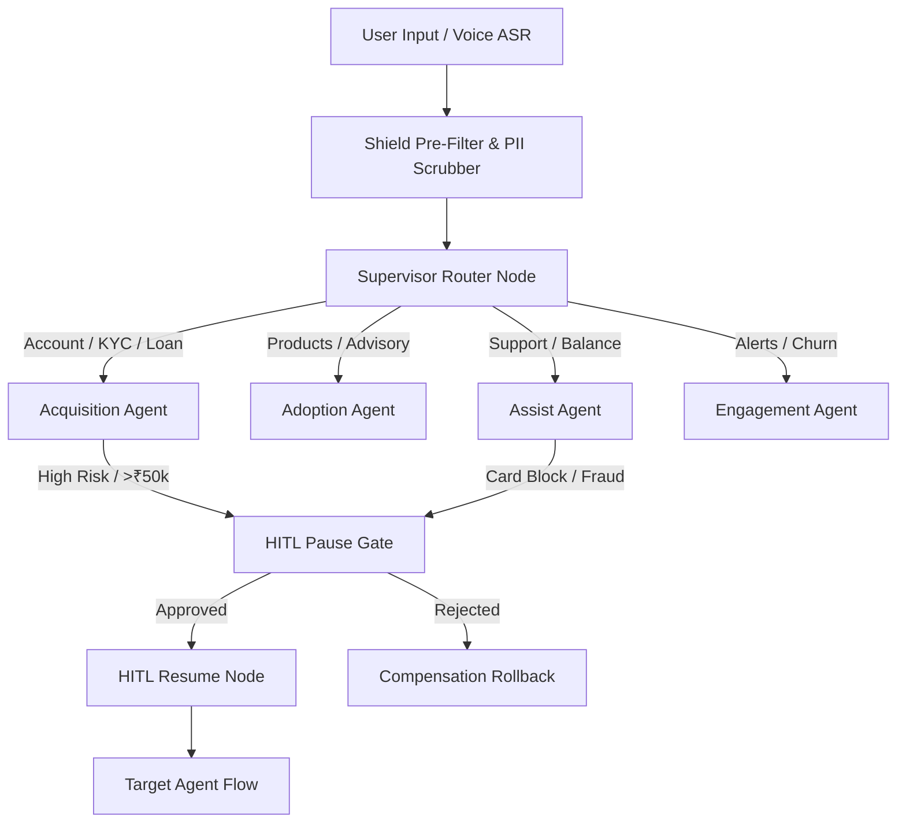

# Sarthi AI — Multi-Agent Banking Orchestration Platform

Sarthi is an enterprise banking assistant and routing platform built for customer service workflows. It routes user inquiries across specialized domain agents, enforcing data privacy guidelines and Human-In-The-Loop (HITL) approval gates for sensitive or high-value transactions.

---

## Core Architecture & Topology

Sarthi manages conversational state using LangGraph graph execution workflows. Requests are pre-processed by security layers before being classified and sent to domain agents.



### Domain Agents
1. **Supervisor (`supervisor.py`)**: Analyzes user intent and assigns task execution to specific domain sub-agents.
2. **Shield (`shield.py` & `pii_middleware.py`)**: Filters potential prompt injections and redacts Personally Identifiable Information (PII) such as Aadhaar, PAN, phone numbers, and account numbers prior to LLM processing.
3. **Acquisition (`acquisition.py`)**: Handles customer onboarding, KYC workflows, and loan application inquiries.
4. **Adoption (`adoption.py`)**: Provides guidance on banking schemes and financial products.
5. **Assist (`assist.py`)**: Handles FAQs, account balances, transaction inquiries, and customer support requests.
6. **Engagement (`engagement.py`)**: Manages notifications, proactive alerts, and follow-ups.
7. **Compensation (`compensation.py`)**: Executes rollback and redressal operations when financial requests are cancelled or rejected.
8. **HITL (`hitl.py`)**: Halts execution at persistent checkpoints for transactions requiring human officer verification.

---

## Technical Features & Fallbacks

### Storage & Checkpointing
- **Production Mode**: Requires PostgreSQL connection via `DATABASE_URL` for persistent graph checkpoints and Redis (`REDIS_URL`) for distributed caching and rate limiting.
- **Demo Mode**: Uses local SQLite (`checkpoints.db`) and in-memory structures when database infrastructure is unavailable.

### NLP Classification & LLM Providers
- **Primary**: Connects to configured cloud LLM endpoints (e.g. NVIDIA NIM APIs) when valid API keys are supplied.
- **Local Fallback**: If external API calls fail or timeout, the system falls back to keyword and pattern-based classification logic to preserve routing continuity.

### Voice Processing (ASR & TTS)
- **Client-Side**: Voice capture relies primarily on browser-native Web Speech API implementations.
- **Backend Fallback**: An experimental Silero VAD / ASR fallback processes raw audio streams sent over WebSockets when client-side speech recognition is unavailable. Text-to-speech output uses external TTS REST APIs or synthesized audio fallbacks during offline execution.

### Audit Logging
- Audit events are recorded locally by appending JSONL records to disk (e.g., inside `~/.sarthi_cache/audit.jsonl`). For centralized enterprise monitoring, a remote SIEM integration must be explicitly configured and connected.

---

## Environment Configuration

To start the server, set the applicable environment variables based on your target deployment environment.

### Production Environment (`SARTHI_ENV=production`)
In production mode, the server strictly enforces security tokens and external database dependency checks. Startup will fail if these variables are missing or use default placeholder strings:
- `SARTHI_ENV`: Must be set to `production`.
- `SARTHI_DEMO_MODE`: Must be set to `false`.
- `SARTHI_API_TOKEN`: Client authentication bearer token (minimum 64 hexadecimal characters).
- `SARTHI_SUPERVISOR_TOKEN`: Supervisor management bearer token (minimum 64 hexadecimal characters).
- `SARTHI_HMAC_SECRET`: Secret key used for cryptographic signing (minimum 64 hexadecimal characters).
- `DATABASE_URL`: Connection URL pointing to a live PostgreSQL database (`postgresql://...`).
- `REDIS_URL`: Connection URL pointing to a live Redis instance.

### Demo / Local Development (`SARTHI_ENV=development`)
In development or demo mode, the backend permits local file-based storage and generates ephemeral tokens if static credentials are omitted:
- `SARTHI_ENV`: Set to `development` (or left unset).
- `SARTHI_DEMO_MODE`: Set to `true` to enable demo user sessions and local SQLite checkpoint fallbacks.
- `SARTHI_HMAC_SECRET`: Required to generate signed temporary demo session tokens.

---

## Running Locally

### Prerequisites
- Node.js v18+ & npm
- Python 3.11+

### 1. Start the Backend API Server
```bash
cd backend
python -m venv venv
# On Windows: .\venv\Scripts\activate
# On Linux/macOS: source venv/bin/activate
pip install -r requirements.txt
python -m uvicorn main:app --host 0.0.0.0 --port 8000
```

### 2. Start the Frontend Dev Server
```bash
cd frontend
npm install
npm run dev
```
The application interface will be accessible at `http://localhost:5173`.

---

## Verification & Testing

To run the backend test suite:
```bash
cd backend
python -m pytest tests/
```

---

## Canonical Deployment

Sarthi defines explicit canonical deployment targets to prevent environment drift:
- **Local Development**: The canonical dev target is `docker-compose.yml` (orchestrating API port 8000, frontend port 3000, metrics port 9090).
- **Production Deployment**: The canonical prod target is Kubernetes manifests in `k8s/`, maintaining parity with docker-compose.

