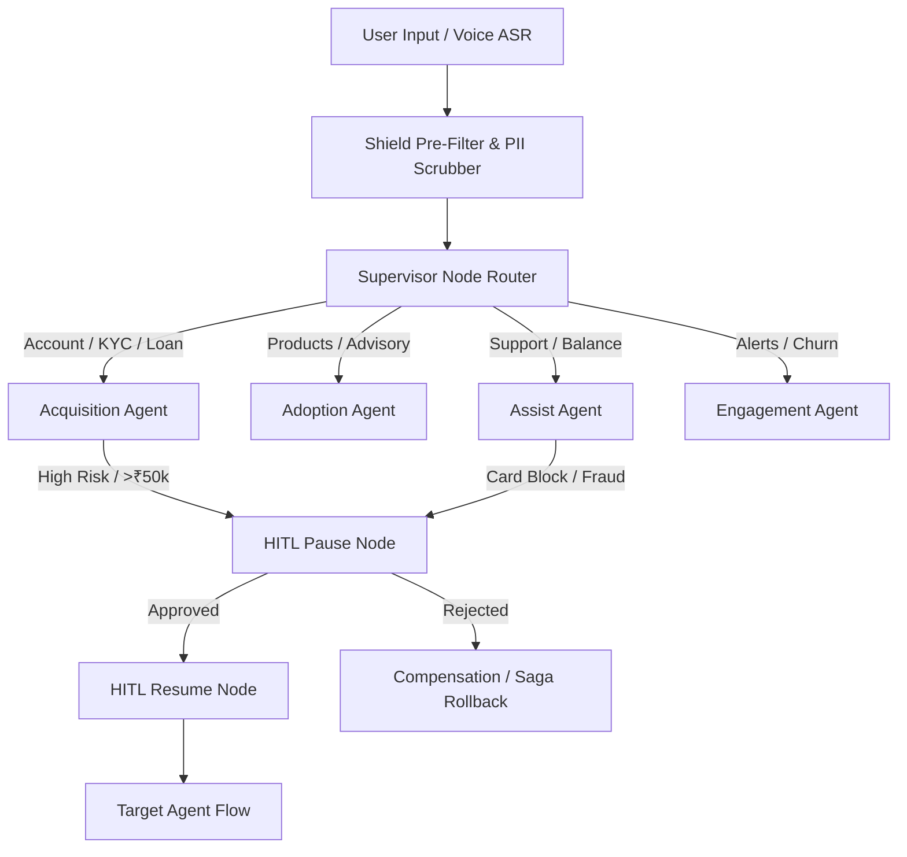

# Sarthi AI — Advanced Multi-Agent Banking Platform for State Bank of India (SBI)

**Sarthi** is an enterprise-grade, autonomous multi-agent banking orchestration platform built to power State Bank of India's next-generation customer experience. Engineered with strict adherence to Indian Banking DPDP Act and RBI data localisation guidelines, Sarthi combines low-latency vernacular assistance with deterministic hierarchical AI agent routing and Human-In-The-Loop (HITL) supervisor breakpoints.

---

## 🏗️ Core Architecture & Topology

Sarthi is orchestrated via a deterministic **LangGraph StateGraph** backed by persistent checkpointing. The system operates asynchronously across specialized domain sub-agents:



### Domain Agents
1. **Supervisor (`supervisor.py`)**: Central intent classifier and router. Evaluates risk scores and routes turns deterministically across domain agents.
2. **Shield (`shield.py` & `pii_middleware.py`)**: Security guardrail responsible for prompt injection blocking and 100% non-recoverable PII scrubbing (Aadhaar, PAN, Phone, Account numbers) prior to any external processing per RBI guidelines.
3. **Acquisition (`acquisition.py`)**: Manages customer onboarding, e-KYC, Video-KYC verification workflows, and loan sanction requests.
4. **Adoption (`adoption.py`)**: Drives product recommendations, savings schemes, and cross-selling advisory.
5. **Assist (`assist.py`)**: Handles FAQs, account balances, transaction inquiries, and general support.
6. **Engagement (`engagement.py`)**: Manages proactive spending alerts, dormant account reactivation, and churn risk mitigation.
7. **Compensation (`compensation.py`)**: Implements the Saga pattern for financial redressal, chargebacks, and rollback workflows when actions are cancelled or rejected.
8. **HITL (`hitl.py`)**: Human-In-The-Loop breakpoint that halts graph execution at persistent checkpoints for high-value (>₹50,000) or high-risk operations until an authorized SBI officer approves.

---

## 🛠️ Brutal Transparency & Tiered Fallback Architecture

To ensure 100% uptime in demo environments and local executions without requiring expensive live API keys, Sarthi implements a brutal, fault-tolerant fallback architecture across all layers:

1. **Storage & Checkpointing**:
   - *Production*: Configured to connect to async PostgreSQL (`AsyncPostgresSaver`) and distributed Redis rate-limiting pools when `DATABASE_URL` and `REDIS_URL` are supplied.
   - *Demo/Local Execution*: Out-of-the-box, Sarthi runs transparently on **async SQLite (`checkpoints.db`)** and **in-memory rate limiting**. No local Docker setup for Postgres/Redis is required to test the full LangGraph state machine.

2. **NLP Intent Classification & Advisory**:
   - *Primary*: Integrates with NVIDIA NIM APIs (`NVIDIA Nemotron-3-Ultra-550B`) for primary complex intent resolution and advisory when `NIM_API_KEY` is provided.
   - *Secondary / Fallback*: Automatically falls back to `Google Gemma-4-31B-IT` via NVIDIA NIM if Nemotron experiences network latency or circuit interruptions.
   - *Rule-Based Fallback*: If API keys are missing or both cloud models trip, the built-in circuit breaker seamlessly downgrades to a **deterministic local rule-based NLP classification engine** (`_classify_intent_fallback`), ensuring zero disruption to agent routing.

3. **Voice Processing (ASR & TTS)**:
   - Sarthi utilizes a resilient 4-tier cascade for voice generation (`tts.py`):
     - **Tier 1**: Bhashini WebSocket API (Vernacular Indian languages)
     - **Tier 2**: NVIDIA Chatterbox NIM
     - **Tier 3**: Sarvam.ai REST API
     - **Tier 4**: Local simulated audio output (Mock Sine Wave) ensures frontend voice playback never throws an unhandled exception during offline demonstrations.

---

## 🔒 Security & Authentication Architecture

- **Tab-Isolated Session Security**: All client authentication tokens (`sarthi_token`, `sarthi_supervisor_token`) are strictly isolated within browser `sessionStorage`. This eliminates cross-tab token leakage and stale state bugs during multi-session agent demonstrations.
- **Header-Enforced API Verification**: Custom middleware (`verify_api_token`) enforces strict header validation (`X-Sarthi-Token`, `Authorization: Bearer <token>`).
- **RBI Data Localisation**: All user inputs pass through regex-based and strict PII scrubbers (`[AADHAAR]`, `[PAN]`, `[ACCOUNT]`) before leaving the local security perimeter.

---

## ⚡ Tech Stack

- **Backend**: Python 3.11, FastAPI, LangGraph, Uvicorn, SQLite/PostgreSQL Async Checkpointing, Pytest.
- **Frontend**: React 18, TypeScript, Vite, Tailwind CSS, Lucide Icons, Axios.
- **AI / NLP**: NVIDIA NIM API (`google/gemma-4-31b-it` / Rule Fallback), Parakeet CTC 1.1B (ASR), Bhashini / Sarvam.ai (TTS).
- **Deployment**: Unified Docker Container running on port `7860` (Hugging Face Spaces compatible).

---

## 🚀 Running Locally

### Prerequisites
- Node.js v18+ & npm
- Python 3.11+

### 1. Start the Backend API Server
```bash
cd backend
python -m venv venv
# On Windows: .\venv\Scripts\activate
# On Linux/macOS: source venv/bin/activate
pip install -r requirements.txt
python -m uvicorn main:app --host 0.0.0.0 --port 8000
```

### 2. Start the Frontend Dev Server
```bash
cd frontend
npm install
npm run dev
```

The frontend will be available at `http://localhost:5173` proxying API requests to `http://localhost:8000`.

---

## 🧪 Verification & Audit Suite

Sarthi includes a comprehensive end-to-end verification suite verifying system health, PII scrubbing compliance, prompt injection resilience, and HITL state management:

```bash
cd backend
python -m pytest tests/
```

---

## 📜 License & Compliance
Built specifically for State Bank of India (SBI) digital transformation initiatives. All workflows adhere to Indian Banking DPDP Act and RBI regulatory standards.
